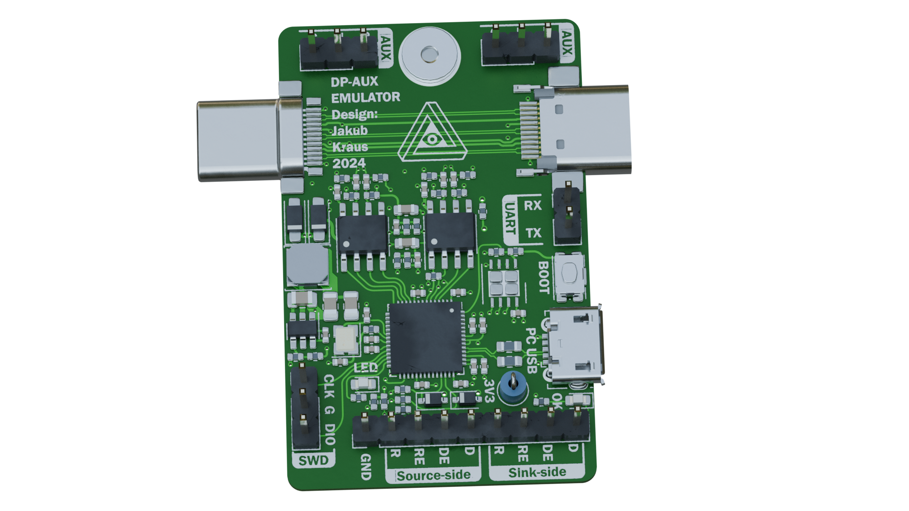

# DP-aux emulator

Hardware design files for a DP-aux emulation board, designed to allow connection of PSVR2 headsets to PC.

# Why

Prior to a March 2024 update of the PSVR2's firmware, the headset reported incorrect information via DP-aux, among others the EDID and DSC capability. A custom EDID can be set without additional hardware, however DSC options cannot be - so the emulator board was born.

# Status as of June 2024

Since this board was built, Sony released firmware update(s) to the PSVR2, which corrected the lies and allow connection to GPUs directly. While this emulator is still useful for enabling "cinema" mode and for future experiments, such as possibly enabling HDR support, most users won't need it.

This board is only for modifying traffic on DP-aux, it doesn't help if your GPU doesn't have a USB-C port. Sony is releasing an adapter for that soon, I have no reason to believe it wouldn't work with 3rd party drivers.

This is a third revision of the PCB, it has been verified to work as designed.

# Everything you need to build some

## PCBs

The board was designed for JLCPCB's assembly. The necessary files are in the ['Manufacturing data'](https://github.com/JX5S/DP_aux_emulator/tree/main/Manufacturing%20data) folder. The zip file is there for a quick download of just those 3 files. The files are:

- ...-Gerbers.zip = Manufacturing data for the circuit board
- ...-BOM.csv = a list of components that need mounting
- ...-top-pos.csv = a list of positions of each component

The only settings that need changing from defaults during ordering at JLCPCB are PCB thickness (0.8mm) and impedance control (Yes; JLC06081H-2116). Detailed screenshots of all settings including defaults are in the ['JLCPCB settings'](https://github.com/JX5S/DP_aux_emulator/tree/main/JLCPCB%20settings) folder.

The 4th image shows edge-rail cut-outs which need to be added to allow surface mounting of these specific USB-C connectors. These can be added by JLC (you do need to explicitly request them), or you can add them yourself in KiCad, or you can have the edge-rails removed and the USB-C connectors added afterwards (JLC will build a mounting adapter for the board at additional cost).

## Firmware

Firmware was written by the autor of the [iVRy SteamVR driver](https://store.steampowered.com/app/992490). A passthrough-only version of the firmware is provided in this repository for testing, a PSVR2-specific firmware is distributed along with the [iVRy PSVR2 driver](https://store.steampowered.com/app/2772740).

## 3D-Printed case

A case has been designed for the DP-AUX emulator by "Hackinside". They have kindly [made the files available](https://www.pcbway.com/project/shareproject/iVRy_PSVR2_DP_AUX_Emulator_Enclosure_case_ef058b5b.html) for anyone that wants to print their own case.

# How it works

On the PCB is an RP2040 microcontroller, which decides which DP-aux requests to modify and which to pass through unchanged. To interface with DP-aux, a pair of SN65MLVD200A differential transceivers are used. The LVDS part of the circuit is based on Bitec's DisplayPort Daughter Card.

Apart from the core DP-aux emulation circuitry, there is a programming micro-USB connector (I would have used a USB-C, but this way it cannot be confused with the PSVR2 port), orientation detection using USB-C CC pins, and a power section, allowing the board to be powered with either the programming USB port or using VBUS from the USB-Cs. Even though the board was made with specifically the PSVR2 in mind, I tried to make it as compliant as possible with a low part count and it should work well with the maximum voltage of USB-PD3.0, 21V.
